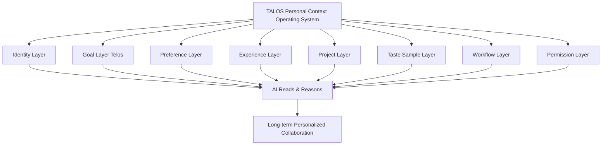
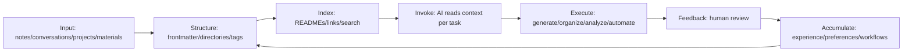

# TALOS Manifesto: Personal Context Sovereignty in the Age of AI

## Trusted AI Life Operating System White Paper v0.3

> Author: WaiNaoWanJia (外脑玩家)
> Version: v0.3 (Sharp Edition)
> Date: 2026-05-06
> Full theory: TALOS Personal Context Operating System
> Previous versions: archived (v0.1 → v0.2 → v0.3)

---

## 0. Before You Read On

Yesterday you asked ChatGPT to help write an article.

You spent 10 minutes explaining your style preferences. 5 minutes on your target audience. 3 minutes correcting words you hate. Finally, the output was decent.

Today you open a new chat.

**Everything resets to zero.**

This isn't your fault. It's not the model's fault either. It's the problem of **context vacuum**.

> How much time do you spend each day explaining who you are to AI?

---

## 1. Executive Summary

AI is transitioning from a "one-shot Q&A tool" to a "long-term collaborative agent." Models keep getting stronger, but your context remains fragmented.

Every conversation, you repeat: who I am, what I'm working on, what style I prefer, where my projects live, what's off-limits, what lessons I've already learned. **Without stable context, AI is an intern who resets their memory every day. With stable context, AI becomes a long-term partner.**

This paper proposes:

> **TALOS Personal Context Operating System** — Trusted AI Life Operating System, abbreviated **TALOS**.

TALOS is a personal knowledge infrastructure designed for the age of AI agents. It organizes your identity, goals, preferences, experience, aesthetics, projects, workflows, samples, and permission boundaries into **human-readable, AI-readable, searchable, portable, and maintainable** context assets.

The core thesis:

> **Don't train the model to be you. Instead, give any AI a stable protocol for reading "who you are, what you want, and how to collaborate with you."**

The future quality of personal-AI collaboration depends not just on model capability, but on **whether individuals possess high-quality, readable, updatable, and portable context assets**.

This paper draws on three types of evidence:

1. **Research evidence**: Studies on MemGPT, Generative Agents, Mem0, Zep, Second Me, Personal Knowledge Graphs, RAG, and Agent Memory consistently point to the same conclusion — long-term memory, dynamic retrieval, knowledge graphs, and context management are the core infrastructure for agents.
2. **Industry trends**: Products like ChatGPT Memory, MCP, Letta, Zep, and AWS AgentCore Memory are all building "memory layers / context layers / tool connection layers" — the infrastructure is here, the memory-layer products are here, **what's missing is personal-level context sovereignty**.
3. **Real-world evidence**: The author's Obsidian + Claude Code "Super Brain" system has been evolving for 15+ months, with the TALOS architecture running stably for 6+ months. It includes an Identity triad, fractal directories, frontmatter content contracts, workflow commands, a memory candidate pool, and entropy-reduction maintenance mechanisms — **TALOS is not theory. It's a running prototype.**

---

## 2. TALOS Definition

**TALOS Personal Context Operating System** (Trusted AI Life Operating System, TALOS) is:

> A system of identity, goals, preferences, experience, aesthetics, projects, samples, workflows, permission boundaries, and knowledge assets — proactively built and maintained by an individual. Stored in open formats, it can be read, searched, invoked, and updated by different AI models, agents, and automation tools, enabling stable long-term personalized collaboration.

One-line version:

> TALOS is the "personal manual + experience library + aesthetic samples + project map + workflow protocol + permission system" for the AI age.

### Why the Name TALOS

Three thousand years ago on the island of Crete, Hephaestus forged a bronze guardian — Talos. Impervious to blades, powered by ichor (divine fluid), he circled the island three times daily, protecting the boundaries of Minoan civilization. His only weakness: a single rivet at his ankle that sealed the ichor's outlet.

TALOS inherits both the name and the design philosophy of the bronze guardian:

- **Forging** — a knowledge base is an engineered artifact, not a hoard
- **Ichor** — structured Context is the system's lifeblood
- **Patrol** — automated maintenance, 24/7
- **Guardianship** — personal context sovereignty, free from platform lock-in
- **Heel** — the final judgment rests with the human, not the system

> For the full mythological mapping, see TALOS Brand Mythology: From Bronze Guardian to Personal Context Sovereignty.

### The Problem It Solves

| Without TALOS | With TALOS |
|---|---|
| Re-explain your identity every conversation | AI reads the Identity layer, onboarded in 30 seconds |
| Output style drifts every time | Reads preferences and samples, style stays consistent |
| Project context lost every time | Reads the project layer, continues from last session |
| Re-learn the same mistakes | Reads experience library, validated judgments auto-reused |
| Agent gradually goes off-rails | Maintenance and compression keep context fresh |
| Platform memory locked in | Local-first, open formats, cross-model portable |

---

## 3. Head-to-Head: TALOS vs Three Alternatives

### 3.1 vs ChatGPT Memory (Platform Memory)

| Dimension | ChatGPT Memory | TALOS |
|---|---|---|
| Who owns the data | OpenAI | You |
| Can you export & migrate | Incomplete, opaque format | Markdown/YAML, move anywhere |
| Structural transparency | Black box | Fully readable and auditable |
| Privacy granularity | Coarse (on/off) | Fine-grained (tiers: public/collaborative/private/prohibited) |
| Cross-platform availability | Only within ChatGPT | Any model, any tool |

**In short: ChatGPT Memory is a rented apartment. TALOS is a house you own.**

Platform memory is convenient — but convenience ≠ sovereignty. Your core context sits on someone else's servers. They set the rules, they change the format, they decide when to charge you.

### 3.2 vs RAG Document Store

| Dimension | RAG Document Store | TALOS |
|---|---|---|
| What it stores | Documents, materials | Identity + preferences + aesthetics + permissions + workflows + documents |
| What AI reads | Keyword-matched paragraphs | Understands who you are, how you work, what results you want |
| Has personality | No | Yes — Identity layer |
| Can execute | No, search only | Yes — workflow layer + permission layer |
| Can evolve | Requires manual maintenance | Candidate pool + feedback loop auto-evolves |

**In short: RAG is a search engine. TALOS is a partner who gets you.**

Standard RAG solves "finding information." TALOS solves "AI understanding you." Finding information is a retrieval problem. Understanding you is a context problem. Different levels entirely.

### 3.3 vs Fine-Tuning / Digital Clones

| Dimension | Fine-Tuning / Digital Clones | TALOS |
|---|---|---|
| What it modifies | Model parameters | Context supply |
| Explainable | Black box | Fully transparent |
| One-shot vs continuous evolution | Each fine-tune requires retraining | Every collaboration auto-accumulates |
| Cost | High (GPU + data) | Low (Markdown + structure) |
| Goal | Make AI become you | Make AI serve you, work within your system |

**In short: Fine-tuning pursues "AI becoming you." TALOS pursues "AI serving you."**

Digital clones aim to simulate people. TALOS aims to augment people. Augmentation is more practical, safer, and more controllable than simulation.

### One-line Summary

> TALOS's goal is not to make AI "like me" — it's to make AI "understand me, and work within my system."

---

## 4. Real-World Evidence: The "Super Brain" System

No fluff. Data first.

### 4.1 System Overview

| Metric | Data |
|---|---|
| Uptime | 15+ months (Vault evolution), 6+ months in TALOS architecture |
| Total notes | 1,458 |
| Directory hierarchy | 3-layer fractal (global rules → directory maps → note contracts) |
| Workflow commands | 8 (capture/intake/digest/maintain/retrieval/memory/create/review) |
| Identity files | 3 (TELOS/CONTEXT/PROFILE) |
| AI collaboration frequency | Daily |

### 4.2 Before vs After

**Scenario: Ask AI to write an article about AI implementation methodology.**

```
Before (without TALOS):
  Open ChatGPT → explain "I create AI tool content" → explain style preferences
  → correct word choices → correct structure → explain I want methodology not tutorial
  → 5 rounds back and forth → 40 minutes → output barely usable
  → next time, start over

After (with TALOS):
  Open Claude Code → AI auto-reads TELOS + CONTEXT + PROFILE
  → within 30 seconds knows who I am, what I'm doing, what style, what words to avoid
  → jumps straight into collaboration → output on-point → first draft in 10 minutes
  → experience auto-flows back into knowledge base
```

**The gap isn't 4x efficiency. The gap is "starting from zero every time" vs "standing on your own shoulders every time."**

### 4.3 Key Design Decisions

**Identity Triad — TALOS's personality core:**

```text
Identity/TELOS.md   → Who I am, what I want, what I believe (goal layer + identity layer)
Identity/CONTEXT.md → What I'm working on right now (project layer)
Identity/PROFILE.md → What I like, what I hate, how to communicate with me (preference layer + boundary layer)
```

**Fractal Directory — every layer is independently AI-readable:**

```text
L1  CLAUDE.md          → Global rules (AI reads this and understands the whole system)
L2  _README.md          → Directory map per folder (AI reads this and knows what's in this layer)
L3  frontmatter         → Per-note contract (AI reads this and knows what this note is, its status)
```

**Memory Candidate Pool — AI-observed preferences don't write directly; they stage for approval first:**

```text
AI observes preference → writes to candidates.md → user confirms → promoted to official PROFILE
```

This isn't a theoretical assumption. It's a mechanism running daily.

### 4.4 What These Designs Mean

The Super Brain isn't "a well-organized knowledge base." It's a set of **AI-readable, executable, evolvable** personal cognitive infrastructure.

15 months ago it was just an Obsidian vault. Over the past 6 months, it evolved into a complete TALOS prototype.

---

## 5. Theoretical Foundations (Condensed)

| Theory | Core Claim | What TALOS Takes |
|---|---|---|
| **Extended Mind** (Clark & Chalmers) | Cognition isn't just in the brain; notes/tools/environments are part of cognition | TALOS is the extended cognitive interface between person and AI |
| **Personal Knowledge Management** | Knowledge needs collecting, organizing, linking, reusing | TALOS adds: knowledge must also be correctly callable by AI |
| **RAG** (Lewis et al.) | Model retrieves external knowledge before answering | No need to train personal info into the model — structured + on-demand retrieval works |
| **Agent Memory** (MemGPT / Mem0 / Zep) | Agents need manageable long-term memory architectures | TALOS's candidate pool, entropy-reduction maintenance, and compression map directly |
| **Personal Knowledge Graphs** (Balog & Kenter) | Relationships matter more than information volume | Fractal directories + wikilinks + frontmatter form a lightweight knowledge graph |

You don't need to understand every theory's details. Just know one thing:

> **From philosophy to engineering to product, every direction points to the same conclusion — individuals need a structured, AI-readable context system.**

---

## 6. Industry Landscape: Where TALOS Fits

```text
2024  MCP Launch                  → Standardized AI-tool connection interface emerges
2024  ChatGPT Memory              → Platforms start doing personal memory
2025  Mem0 / Zep / Letta          → Memory-layer products explode (developer-facing)
2025  AWS AgentCore Memory        → Cloud vendors enter, memory becomes infrastructure
2025  Second Me                   → Personal AI sovereignty concept surfaces
2026  MCP ecosystem boom / Claude Code goes enterprise  → Personal agent infrastructure becomes a must-have
2026  TALOS v0.3 released                                     → Personal context sovereignty
                ↑
             TALOS is here
```

**The infrastructure layer (MCP) is here. Memory-layer products (Mem0/Zep) are here. What's missing is personal-level context sovereignty.**

TALOS fills exactly that gap:

- MCP solved "how AI connects to tools" — TALOS solves "how AI connects to you"
- Mem0/Zep solved "how agents remember things" — TALOS solves "who owns what's remembered, how it's updated, how it migrates"
- ChatGPT Memory solved "the platform remembers for you" — TALOS solves "you remember yourself, and take it to any platform"

The industry is shifting from "whose model is stronger" to "whose context is better." At the personal level, that "who" is you.

---

## 7. The TALOS Eight-Layer Architecture



### 7.1 Identity Layer: Who I Am

Records identity, profession, roles, relationships, and life stage.

### 7.2 Goal Layer: Where I'm Going

Records long-term goals, current narrative, and phase-specific tasks.

### 7.3 Preference Layer: What I Like

Records communication style, writing style, tool preferences, aesthetic preferences, and hard boundaries.

### 7.4 Experience Layer: What I've Validated

Records methodologies, post-mortems, case studies, lessons learned, and judgment models.

### 7.5 Project Layer: What I'm Working On

Records current projects, priorities, status, decisions, and next steps.

### 7.6 Taste Sample Layer: What Matches My Aesthetic

The taste sample layer is TALOS's advanced asset. Aesthetics are hard to describe abstractly, but can be conveyed through samples.

Can include:

- Good article samples / title samples / cover samples / product samples / service copy samples
- **Negative samples** ("don't write like this" is more informative than "write like this")

### 7.7 Workflow Layer: How I Work

The workflow layer transforms AI from an "answerer" to a "collaborator."

Example workflow commands: `/capture`, `/intake`, `/maintain`, `/digest`, `/retrieval`, `/memory`, `/create`, `/review`.

### 7.8 Permission Layer: What AI Can and Cannot Do

In the agent era, permission boundaries aren't a side feature — they're infrastructure.

```text
Auto-allowed: Organize, search, generate drafts, make suggestions
Must confirm: Modify Identity, publish content, delete files, make payments, send externally
Prohibited: Leak privacy, tamper with core beliefs, bypass review, destroy file structure
```

---

## 8. TALOS Operating Mechanism



TALOS is a loop, not a static folder.

**Five key mechanisms:**

| Mechanism | What It Does | Why It Matters |
|---|---|---|
| Write | Tag incoming info with source, type, status, purpose | Otherwise the knowledge base becomes digital hoarding |
| Retrieve | AI reads relevant context per task, not everything at once | Context window is a scarce resource |
| Compress | Periodic summarization, merging, deduplication, archiving | Long-running systems inevitably bloat |
| Review | Key preferences, identity, and facts must pass user confirmation | AI auto-writes may be wrong or one-sided |
| Feedback | Every collaboration produces "task result + experience deposit" | Aligns with the "Output Feedback" principle |

---

## 9. Context Health Model: Scattered, Dirty, Rotten

Three Context pathologies:

| Pathology | Symptoms | Consequences | Treatment |
|---|---|---|---|
| **Scattered** | Information spread across multiple locations | AI can't find key background | Unified entry points, directory indexes, links |
| **Dirty** | Messy formats, no metadata, lots of noise | AI reads inaccurately | Markdown + frontmatter + cleaning |
| **Rotten** | Outdated, contradictory, redundant information | AI acts on stale context | Periodic maintenance, summarization, archiving, version control |

> Hoarding information is instinct. Reducing noise is skill.

TALOS's long-term value doesn't come from "how much content" — it comes from **entropy reduction capability**.

---

## 10. TALOS Maturity Model (with Self-Assessment)

| Level | Name | State | Self-Test: Can Your AI Do This? |
|---|---|---|---|
| **L0** | Ad-hoc Prompt | No system | Do you explain your background from scratch every conversation? |
| **L1** | Personal Profile Card | Has identity | Can your AI accurately describe your profession and core goals without asking? |
| **L2** | AI-Readable Knowledge Base | Has structure | Can your AI automatically search your notes for content relevant to the current task? |
| **L3** | Workflow System | Can execute | Can your AI run a complete workflow (capture → archive) without step-by-step instructions? |
| **L4** | Memory System | Can evolve | Can your AI auto-deposit preferences and experience from collaboration, and apply them next time? |
| **L5** | Personal Agent OS | Can collaborate | Can your AI complete project tasks while you sleep, delivering a reviewable result in the morning? |
| **L6** | Productizable TALOS | Can deliver | Can you replicate this system for someone else and get them running too? |

**The author's current level: between L4–L5, with productization approaching L6.**

Most people stay at L0. A few reach L1. By L3 you already feel a qualitative shift — AI goes from "re-meeting you every time" to "feeling like a partner of six months."

---

## 11. Minimum Viable TALOS: 30-Minute Launch

You don't need a complex system to start.

### 9 Files

```text
Identity/
  00-who-am-i.md
  01-long-term-goals.md
  02-current-status.md
  03-preferences-and-boundaries.md

Projects/
  project-overview.md

Methods/
  my-methodology.md

Samples/
  samples-I-approve.md

AI-Rules/
  ai-collaboration-guide.md
  permission-boundaries.md
```

### AI Collaboration Guide Template

```markdown
# AI Collaboration Guide

## My Identity

## My Long-term Goals

## Current Priority Projects

## My Expression Preferences

## My Aesthetic Preferences

## My Judgment Principles

## Common Workflows

## What You Can Do Proactively

## What You Must Ask Me First

## What You Must Never Do
```

### 30-Minute Launch Method

| Time | Action | Output |
|---|---|---|
| 5 min | Write one sentence about your identity | Who I am |
| 5 min | Write three goals | What I want |
| 5 min | Write five preferences | What I like |
| 5 min | Write three projects | What I'm doing |
| 5 min | Write three boundaries | What AI must not do |
| 5 min | Have AI read and test | **Can AI accurately describe who you are?** |

The last 5 minutes are key — test whether your AI, after reading these files, can accurately describe who you are without asking you anything. If it can, your TALOS is already working.

---

## 12. Risks and Governance

### 12.1 Privacy Tiers

```text
Public context: Any AI can read (profession, public goals, writing style)
Collaborative context: Work AI can read (project details, methodologies, client info)
Private context: Local only, read cautiously (personal finances, family info)
Prohibited context: AI may not access by default (passwords, keys, legally sensitive info)
```

### 12.2 Memory Pollution

AI auto-written memories may be wrong, one-sided, or outdated. Recommended: candidate pool mechanism.

```text
Observe preference → write to candidate pool → user confirms → promote to official memory
```

### 12.3 Platform Lock-in

Platform memory is convenient, but convenience ≠ personal asset. Core context stays in open formats (Markdown, YAML, JSON). **You can be served by any platform, but you cannot be owned by any platform.**

### 12.4 Permission Loss of Control

When AI simultaneously holds private data, external communication ability, and tool execution permissions, risk rises significantly. TALOS must codify permission boundaries — this is safety infrastructure for the agent era.

### 12.5 Context Rot

Longer context ≠ better context. Long contexts introduce noise, conflicts, and stale information. TALOS needs regular maintenance, not infinite stacking. This is exactly why the `/maintain` command exists.

---

## 13. TALOS Design Principles

| # | Principle | Meaning |
|---|---|---|
| 1 | **Local-first** | Core context owned by the user |
| 2 | **Open formats** | Markdown, YAML, JSON |
| 3 | **Human-machine co-readable** | Humans can understand, AI can parse |
| 4 | **Less but precise** | Better less than dirty |
| 5 | **Sample-driven** | Aesthetics and style through samples, not abstractions |
| 6 | **Workflow-first** | Executable knowledge is real asset |
| 7 | **Tiered permissions** | Closer to publishing/money/deletion/privacy → more confirmation needed |
| 8 | **Continuous entropy reduction** | Regular cleaning, compression, archiving |
| 9 | **Experience feedback** | Every collaboration deposits reusable experience |
| 10 | **Cross-model portable** | Not locked to a single platform |

---

## 14. Application Scenarios

### Content Creators

AI reads topic pools, expression style, viral samples, platform rules → assists with topic selection, drafting, editing, and multi-platform content splitting.

### Consultants / Coaches

AI reads methodologies, client profiles, case libraries, diagnostic processes → assists with generating proposals and deliverables.

### Solo Entrepreneurs

AI reads business models, product roadmaps, customer feedback, pricing systems → helps the founder advance content, sales, delivery, and reviews.

### Researchers

AI reads paper notes, research questions, citation libraries, and writing plans → assists with literature reviews, hypothesis generation, and paper writing.

### Enterprise Knowledge Systems

TALOS can scale to team context systems: organizational identity, departmental goals, project progress, knowledge bases, permission regimes, approval mechanisms.

---

## 15. From Personal to Product: TALOS Commercialization Path

TALOS productization isn't selling templates — it's selling "the cognitive operating system for the AI age."

Four product tiers:

| Tier | Product | Value |
|---|---|---|
| L0 | Free plugin / open-source template | Build awareness, own the keyword |
| L1 | Pre-built Vault + tutorials | Let users follow along and build it |
| L2 | Peer coaching cohort | Solve the "stuck and no feedback" problem |
| L3 | 1v1 customization | Build a running system for the client |

The core pitch isn't "Obsidian templates":

> **Let AI know you, do your work, and continuously accumulate your personal assets.**

---

## 16. Future Predictions

### Everyone Will Need an AI-Readable Version of Themselves

Resumes let companies understand you. Portfolios let clients understand you. **TALOS lets AI understand you.**

### Context Will Become a New Type of Personal Asset

Future high-value personal assets: personal knowledge base, personal aesthetic samples, personal decision records, personal workflows, personal AI collaboration protocols.

### From Software User to System Builder

A new category of people: **System Builders**. They don't chase tools, don't hoard prompts — they build systems that make AI work for them.

### Models Will Commoditize, Context Will Differentiate

As model capabilities converge, what truly differentiates output quality will be: your Context, your tool environment, your aesthetic samples, your workflows, your judgment standards.

---

## 17. Conclusion

TALOS Personal Context Operating System is the personal infrastructure for the agent age.

It's not a regular knowledge base, not a one-shot prompt, not model fine-tuning, and not platform memory. It's a context asset system that is **owned, maintained, migrated, and authorized** by the individual.

The essence of TALOS:

> Make tacit knowledge explicit. Structure experience. Sample aesthetics. Protocolize workflows. Institutionalize permission boundaries.

The future AI collaboration gap isn't just a model gap — it's a **context gap**.

> Whoever better structures their experience, aesthetics, goals, projects, and workflows will better leverage AI agents.

**This is the theoretical foundation of TALOS, and the core infrastructure of the "System Builder" path.**

---

## 18. References

### Research Papers

- Packer et al. *MemGPT: Towards LLMs as Operating Systems*. arXiv:2310.08560. https://arxiv.org/abs/2310.08560
- Park et al. *Generative Agents: Interactive Simulacra of Human Behavior*. arXiv:2304.03442. https://arxiv.org/abs/2304.03442
- Mem0 Team. *Mem0: Building Production-Ready AI Agents with Scalable Long-Term Memory*. arXiv:2504.19413. https://arxiv.org/abs/2504.19413
- Zep. *Zep: A Temporal Knowledge Graph Architecture for Agent Memory*. arXiv:2501.13956. https://arxiv.org/abs/2501.13956
- *AI Agents Need Memory Control Over More Context*. arXiv:2601.11653. https://arxiv.org/abs/2601.11653
- *Memory for Autonomous LLM Agents: Mechanisms, Evaluation, and Emerging Frontiers*. arXiv:2603.07670. https://arxiv.org/abs/2603.07670
- *How People Manage Knowledge in their "Second Brains"*. arXiv:2509.20187. https://arxiv.org/abs/2509.20187
- Balog & Kenter. *Personal Knowledge Graphs: A Research Agenda*. SIGIR 2021. https://doi.org/10.1145/3404835.3462801
- Lewis et al. *Retrieval-Augmented Generation for Knowledge-Intensive NLP Tasks*. NeurIPS 2020. https://arxiv.org/abs/2005.11401

### Industry & Product Resources

- OpenAI. *Memory and new controls for ChatGPT*. https://openai.com/index/memory-and-new-controls-for-chatgpt
- Anthropic. *Introducing the Model Context Protocol*. https://www.anthropic.com/news/model-context-protocol
- HumanLayer. *12-Factor Agents*. https://www.humanlayer.dev/blog/12-factor-agents
- Letta Docs. *Agent memory & architecture*. https://docs.letta.com/guides/agents/architectures/memgpt
- Zep Docs. *Agent Memory*. https://www.getzep.com/product/agent-memory/
- AWS. *Amazon Bedrock AgentCore Memory*. https://aws.amazon.com/blogs/machine-learning/amazon-bedrock-agentcore-memory-building-context-aware-agents/
