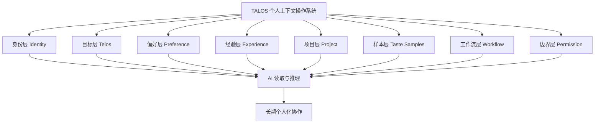
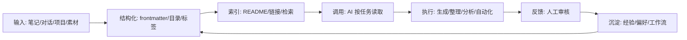

# TALOS 宣言：AI 时代的个人上下文主权

## Trusted AI Life Operating System White Paper v0.4

> 作者：外脑玩家
> 版本：v0.4（实战更新版）
> 日期：2026-06-04
> 理论母本：[[04-项目/TALOS品牌发布/理论/TALOS 个人上下文操作系统：一种面向智能体时代的个人知识基础设施]]
> 上一版：已归档（v0.1 → v0.2 → v0.3）
> 库内支撑：[[04-项目/TALOS品牌发布/支撑/Context资产论：AI系统的真正护城河]]、[[04-项目/TALOS品牌发布/支撑/后指令时代：从写提示到给目标]]、[[02-洞察/框架/Harness决定Agent天花板：四个可借力的工程模式]]、[[05-归档/外挂大脑-旧版/外挂大脑产品化方案]]、[[Identity/TELOS]]、[[Identity/CONTEXT]]、[[Identity/PROFILE]]

---

## 0. 在你读下去之前

昨天你让 ChatGPT 帮你写一篇文章。

你花了 10 分钟解释你的风格偏好。5 分钟说明你的目标受众。3 分钟纠正它用了你讨厌的词。终于输出像样了。

今天你打开一个新对话。

**一切归零。**

这不是你的问题，也不是模型的问题。这是**上下文真空**的问题。

> 你每天花多少时间给 AI 解释你是谁？

---

## 1. 执行摘要

AI 正在从「一次性问答工具」进入「长期协作智能体」阶段。模型越来越强，但你的上下文依然破碎。

每次对话，你都在重复：我是谁、我在做什么、我喜欢什么风格、我的项目在哪、哪些事情不能做、哪些经验已经被验证过。**没有稳定上下文，AI 就是每天重置记忆的实习生；有稳定上下文，AI 才是长期搭档。**

本文提出：

> **TALOS 个人上下文操作系统**，Trusted AI Life Operating System，简称 **TALOS**。

TALOS 是一种面向智能体时代的个人知识基础设施。它把你的身份、目标、偏好、经验、审美、项目、工作流、样本和权限边界，整理成**人类可读、AI 可读、可检索、可迁移、可维护**的上下文资产。

核心判断——

> **不把模型训练成你，而是给任何 AI 一套稳定读取"你是谁、你要什么、如何与你协作"的上下文协议。**

未来个人与 AI 的协作质量，不只取决于模型能力，更取决于**个人是否拥有高质量、可读取、可更新、可迁移的上下文资产**。

本文基于三类证据：

1. **科研证据**：MemGPT、Generative Agents、Mem0、Zep、Second Me、Personal Knowledge Graph、RAG、Agent Memory 等研究一致指向——长期记忆、动态检索、知识图谱和上下文管理是 Agent 的核心基础设施。
2. **产业趋势**：ChatGPT Memory、MCP、Letta、Zep、AWS AgentCore Memory 等产品都在构建"记忆层 / 上下文层 / 工具连接层"——基础设施有了，记忆层产品有了，**缺的是个人层面的上下文主权**。
3. **实战证据**：外脑玩家的 Obsidian + Claude Code「超级大脑」系统，Vault 已持续演化 15 个月，其中 TALOS 形态稳定运行 6 个月+，形成 Identity 三文件、分形目录、frontmatter 内容契约、工作流命令、记忆候选池、熵减维护机制——**TALOS 不是理论，是已跑通的原型**。

---

## 2. TALOS 定义

**TALOS 个人上下文操作系统**（Trusted AI Life Operating System，TALOS）是指：

> 一套由个人主动构建和维护的身份、目标、偏好、经验、审美、项目、样本、工作流、权限边界与知识资产系统。以开放格式存在，可被不同 AI 模型、智能体和自动化工具读取、检索、调用和更新，从而支持稳定的长期个人化协作。

一句话版本：

> TALOS 是 AI 时代的"个人说明书 + 经验库 + 审美样本 + 项目地图 + 工作流协议 + 权限系统"。

### 为什么叫 TALOS

三千年前的克里特岛，赫菲斯托斯锻造了一个青铜守卫——Talos。全身刀枪不入，灵液（ichor）驱动运转，每天绕岛三圈巡逻，守护米诺斯文明的边界。唯一弱点在脚踝：一颗铆钉封住灵液的出口。

TALOS 继承了青铜守卫的名字，也继承了它的设计哲学：

- **锻造**——知识库是工程产物，不是囤积物
- **灵液**——结构化 Context 是系统的命脉
- **巡逻**——自动化运维，24/7 不间断
- **守护**——个人上下文主权，不被平台锁死
- **命门**——最终判断力在人，不在系统

> 详细神话映射见 [[04-项目/TALOS品牌发布/理论/TALOS品牌神话：从青铜守卫到个人上下文主权]]

### 它解决的问题

| 没有 TALOS | 有 TALOS |
|---|---|
| 每次对话重复解释身份 | AI 读取 Identity 层，30 秒进入状态 |
| 输出风格每次漂移 | 读取偏好与样本，风格稳定 |
| 项目上下文每次丢失 | 读取项目层，延续上次进度 |
| 踩过的坑重复踩 | 读取经验库，已验证的判断自动复用 |
| Agent 跑着跑着失控 | 维护与压缩机制保证上下文新鲜 |
| 平台记忆被锁定 | 本地优先、开放格式、跨模型可迁移 |

---

## 3. 正面交锋：TALOS vs 三个假想敌

### 3.1 vs ChatGPT Memory（平台记忆）

| 维度 | ChatGPT Memory | TALOS |
|---|---|---|
| 谁拥有数据 | OpenAI | 你自己 |
| 能否导出迁移 | 不完整，格式不透明 | Markdown/YAML，随便搬 |
| 结构透明度 | 黑箱 | 完全可读可审计 |
| 隐私粒度 | 粗（开/关） | 细（分级：公开/协作/私密/禁止） |
| 跨平台可用性 | 只在 ChatGPT 内 | 任何模型、任何工具 |

**一句话：ChatGPT Memory 是租的公寓，TALOS 是你自己的房子。**

平台记忆方便——但方便不等于主权。你的核心上下文放在别人服务器上，规则别人定、格式别人改、哪天收费别人说了算。

### 3.2 vs RAG 文档库

| 维度 | RAG 文档库 | TALOS |
|---|---|---|
| 存什么 | 文档、资料 | 身份 + 偏好 + 审美 + 权限 + 工作流 + 文档 |
| AI 读到什么 | 检索关键词匹配的段落 | 理解你是谁、你怎么做事、你要什么结果 |
| 有人格吗 | 没有 | 有——Identity 层 |
| 能执行吗 | 不能，只检索 | 能——工作流层 + 权限层 |
| 能进化吗 | 需人工维护 | 候选池 + 回流机制自动进化 |

**一句话：RAG 是搜索引擎，TALOS 是懂你的搭档。**

普通 RAG 解决"找到信息"，TALOS 解决"AI 理解你"。"找到信息"是检索问题，"理解你"是上下文问题。两个层次。

### 3.3 vs 微调 / 数字分身

| 维度 | 微调 / 数字分身 | TALOS |
|---|---|---|
| 改什么 | 模型参数 | 上下文供给 |
| 可解释吗 | 黑箱 | 完全透明 |
| 一次成型 vs 持续进化 | 每次微调都要重新训练 | 每次协作都在自动沉淀 |
| 成本 | 高（GPU + 数据） | 低（Markdown + 结构化） |
| 目标 | 让 AI 像你 | 让 AI 懂你、按你的系统工作 |

**一句话：微调追求"AI 成为你"，TALOS 追求"AI 服务于你"。**

数字分身的目标是模拟人，TALOS 的目标是辅助人。辅助人比模拟人更实用、更安全、更可控。

### 一句话总结三个交锋

> TALOS 的目标不是让 AI"像我"，而是让 AI"懂我，并按我的系统工作"。

---

## 4. 实战证据：外脑玩家「超级大脑」

不废话，先看数据。

### 4.1 系统概览

| 指标 | 数据 |
|---|---|
| 运行时长 | 16 个月+（Vault 演化），其中 TALOS 形态 7 个月+ |
| 笔记总量 | 1300+ 篇（含主动熵减归档，净增质量而非数量） |
| 目录层级 | 4 层分形（L0 治理自检 → L1 全局规则 → L2 目录地图 → L3 笔记契约） |
| 工作流命令 | 10 个（intake/digest/maintain/retrieval/memory/create/morning/mine-rules/full-cycle/weekly-reset） |
| 身份文件 | 4 个（TELOS/CONTEXT/PROFILE/voice-profile） |
| AI 协作频率 | 每日 |

### 4.2 Before vs After

**场景：让 AI 帮我写一篇关于 AI 落地方法论的文章。**

```
Before（没有 TALOS）：
  打开 ChatGPT → 解释"我是做 AI 工具内容创作的" → 解释风格偏好
  → 纠正用语 → 纠正结构 → 解释我要的是方法论不是教程
  → 来回 5 轮 → 40 分钟 → 输出勉强能用
  → 下次又要重来

After（有 TALOS）：
  打开 Claude Code → AI 自动读取 TELOS + CONTEXT + PROFILE
  → 30 秒内知道我是谁、我在做什么、我要什么风格、哪些词不能用
  → 直接进入协作 → 输出风格对路 → 10 分钟出初稿
  → 经验自动回流到知识库
```

**差距不是 4 倍效率。差距是"每次从零开始"vs"每次站在自己肩膀上"。**

### 4.3 关键设计

**Identity 三文件——TALOS 的人格内核：**

```text
Identity/TELOS.md        → 我是谁、我要什么、我信什么（目标层 + 身份层）
Identity/CONTEXT.md      → 我现在在做什么（项目层）
Identity/PROFILE.md      → 我喜欢什么、讨厌什么、怎么和我沟通（偏好层 + 边界层）
Identity/voice-profile.md → 可移植声音档案（PROFILE+TELOS 派生，用于外部 AI 工具）
```

**分形目录——每一层都能独立被 AI 理解：**

```text
L0  validate-governance.sh → 治理自检（结构声明/命令契约/项目对账三类漂移检测）
L1  CLAUDE.md              → 全局规则（AI 读这个就知道整个系统怎么运转）
L2  _README.md              → 每个目录的地图（AI 读这个就知道这层有什么）
L3  frontmatter             → 每篇笔记的契约（AI 读这个就知道这篇是什么、什么状态）
```

**记忆候选池——AI 观察到的偏好不直接写入，先暂存再审批：**

```text
AI 观察到偏好 → 写入 candidates.md → 用户确认 → 晋升正式 PROFILE
```

这不是理论假设。这是每天在跑的机制。

**自成长回路——系统从被动工具变成主动助手：**

```text
observe.py（观察器）→ patterns.json（模式识别）→ candidates.md（候选池）→ /digest（人工确认）→ PROFILE/OPERATING_RULES
```

行为噪音已自动分流，候选池只收真实偏好信号。系统会从日常协作中自动发现你的偏好模式，等你确认后生效——**系统不会偷偷改你，但也不会错过你真正想要的东西。**

### 4.4 这些设计意味着什么

超级大脑不是"笔记整理得比较好的知识库"。它是一套**AI 可读取、可执行、可进化**的个人认知基础设施。

15 个月前它还只是一个 Obsidian vault。过去 7 个月它进化成了 TALOS 的完整原型。

---

## 5. 理论基础（浓缩版）

| 理论 | 核心主张 | TALOS 取了什么 |
|---|---|---|
| **扩展心智**（Clark & Chalmers） | 认知不只发生在脑内，笔记/工具/环境也是认知的一部分 | TALOS 是个人与 AI 之间的扩展认知接口 |
| **个人知识管理** | 知识需收集、整理、关联、复用 | TALOS 加了一条：知识还要能被 AI 正确调用 |
| **RAG**（Lewis et al.） | 模型回答前先检索外部知识 | 无需把个人信息训练进模型，结构化 + 按需检索即可 |
| **Agent Memory**（MemGPT / Mem0 / Zep） | 智能体需要可管理的长期记忆架构 | TALOS 的记忆候选池、熵减维护、压缩机制直接对应 |
| **个人知识图谱**（Balog & Kenter） | 关系比信息量更重要 | 分形目录 + wikilink + frontmatter 构成轻量知识图谱 |

不需要理解每个理论的细节。只需要知道一件事：

> **从哲学到工程到产品，所有方向都在指向同一个结论——个人需要一套结构化的、AI 可读的上下文系统。**

详细理论展开见 [[04-项目/TALOS品牌发布/理论/TALOS 个人上下文操作系统：一种面向智能体时代的个人知识基础设施]]。

---

## 6. 产业趋势定位：TALOS 填的是哪个空

```text
2024  MCP 发布              → AI-工具连接的标准化接口出现
2024  ChatGPT Memory        → 平台开始做个人记忆
2025  Mem0 / Zep / Letta    → 记忆层产品爆发（面向开发者）
2025  AWS AgentCore Memory  → 云厂商入场，记忆成基础设施
2025  Second Me             → 个人 AI 主权概念浮出水面
2026  MCP 生态爆发 / Claude Code 企业化  → 个人 Agent 基础设施成刚需
2026  TALOS v0.3 发布                      → 个人上下文主权
                ↑
             TALOS 在这里
```

**基础设施层（MCP）有了。记忆层产品（Mem0/Zep）有了。缺的是个人层面的上下文主权。**

TALOS 填的就是这个空：

- MCP 解决了"AI 怎么连工具"——TALOS 解决"AI 怎么连你"
- Mem0/Zep 解决了"Agent 怎么记东西"——TALOS 解决"记的东西归谁、怎么更新、怎么迁移"
- ChatGPT Memory 解决了"平台帮你记"——TALOS 解决"你自己记，带到任何平台"

产业正在从"谁的模型更强"转向"谁的上下文更好"。个人层面，这个"谁"就是你。

---

## 7. TALOS 八层架构



### 7.1 身份层：我是谁

记录身份、职业、角色、关系和人生阶段。

在外脑玩家系统中，对应 [[Identity/TELOS]]：

- 普通人进入 AI 领域的关键节点
- AI 工具领域内容创作者
- 系统搭建者
- 外挂大脑方法论布道者

### 7.2 目标层：我要去哪

记录长期目标、当前叙事、阶段性任务。

- 成为 AI 工具领域 KOL
- 建立稳定一人企业
- 打造年轻人可复制的 0→1 方法论
- 当前聚焦内容引擎 + 陪跑服务 MVP

### 7.3 偏好层：我喜欢什么

记录沟通风格、写作风格、工具偏好、审美偏好、禁区。

[[Identity/PROFILE]] 已具备典型 TALOS 偏好层特征：

- 称呼"外脑玩家Haaper"
- 800 字内，简洁精准
- 极简、原子化笔记
- 禁止 AI 味口头禅、禁止互联网黑话

### 7.4 经验层：我验证过什么

记录方法论、复盘、案例、踩坑、判断模型。

库内经验资产：

- [[04-项目/TALOS品牌发布/支撑/Context资产论：AI系统的真正护城河]]
- [[02-洞察/方法论/Claude Code协作心法：6个Context管理原则]]
- [[02-洞察/方法论/AI落地三原则：分层评估·Aha优先·产出回流]]
- [[02-洞察/方法论/做事用系统不要状态]]

### 7.5 项目层：我正在做什么

记录当前项目、优先级、状态、决策和下一步。

对应 [[Identity/CONTEXT]] 和 [[04-项目/_看板]]：

- TALOS 品牌发布（P0）
- 内容引擎（P0）
- 陪跑服务 MVP（P0）
- B 端系统架构服务（医美/科研/医疗多行业）
- GEO 个人站点
- 钩子产品 / 私域社群（待启动）

### 7.6 样本层：什么符合我的品味

样本层是 TALOS 的高阶资产。审美很难被抽象描述，但可以通过样本让 AI 学习。

可包含：

- 好文章样本 / 标题样本 / 封面样本 / 产品样本 / 服务文案样本
- **反面样本**（"不要写成这样"比"写成这样"更有信息量）

库内 [[04-项目/内容创作/草稿/系统搭建者宣言]]、[[04-项目/内容创作/选题池]]、各平台内容草稿均可成为样本层。

### 7.7 工作流层：我如何做事

工作流层让 AI 从"回答者"变成"协作者"。

外脑玩家系统中已有 10 个命令：`/intake`、`/digest`、`/maintain`、`/retrieval`、`/memory`、`/create`、`/morning`、`/mine-rules`、`/full-cycle`、`/weekly-reset`。

### 7.8 边界层：AI 能做什么，不能做什么

智能体时代，权限边界不是附属功能，是基础设施。

```text
可自动执行：整理、检索、生成草稿、提出建议
必须确认：修改 Identity、发布内容、删除文件、付款、对外发送
禁止执行：泄露隐私、篡改核心信念、绕过审核、破坏文件结构
```

---

## 8. TALOS 运行机制



TALOS 是循环，不是静态资料夹。

**五个关键机制：**

| 机制 | 做什么 | 为什么重要 |
|---|---|---|
| 写入 | 信息进入时标注来源、类型、状态、用途 | 否则知识库变数字囤积 |
| 检索 | AI 按任务读取相关上下文，不一次全读 | 上下文窗口是稀缺资源 |
| 压缩 | 周期性摘要、合并、去重、归档 | 长期系统必然膨胀 |
| 审核 | 关键偏好、身份、事实必须经用户确认 | AI 自动写入可能错误或片面 |
| 回流 | 每次协作产出"任务结果 + 经验沉淀" | 与 [[02-洞察/方法论/AI落地三原则：分层评估·Aha优先·产出回流]] 一致 |

---

## 9. Context 健康模型：散、脏、腐

库内 [[04-项目/TALOS品牌发布/支撑/Context资产论：AI系统的真正护城河]] 提出三种 Context 病理：

| 病理 | 表现 | 后果 | 治理 |
|---|---|---|---|
| **散** | 信息分散在多个地方 | AI 找不到关键背景 | 统一入口、目录索引、链接 |
| **脏** | 格式混乱、无元数据、噪音多 | AI 读不准 | Markdown + frontmatter + 清洗 |
| **腐** | 信息过时、矛盾、冗余 | AI 基于旧上下文行动 | /maintain、摘要、归档、版本控制 |

> 堆信息是本能，减噪音是能力。

TALOS 的长期价值不来自"有多少内容"，而来自**熵减能力**。

---

## 10. TALOS 成熟度模型（含自测）

| 等级 | 名称 | 状态 | 自测：你的 AI 能做到吗？ |
|---|---|---|---|
| **L0** | 临时 Prompt | 无系统 | 你每次对话都要从零解释背景？ |
| **L1** | 个人资料卡 | 有身份 | 你的 AI 能在不问你的情况下，准确描述你的职业和核心目标吗？ |
| **L2** | AI 可读知识库 | 有结构 | 你的 AI 能自动检索你的笔记，找到和当前任务相关的历史内容吗？ |
| **L3** | 工作流系统 | 能执行 | 你的 AI 能自动执行完整工作流（比如从捕捉到归档），不需要你逐步指令吗？ |
| **L4** | 记忆系统 | 能进化 | 你的 AI 能从协作中自动沉淀偏好和经验，下次自动应用吗？ |
| **L5** | 个人智能体操作系统 | 能协作 | 你的 AI 能在你睡觉时完成项目任务，早上给你一份可审阅的结果吗？ |
| **L6** | 可产品化 TALOS | 能交付 | 你能把这套系统复制给别人，让别人也跑起来吗？ |

**外脑玩家当前：L4-L5 之间，产品化方案正在迈向 L6。**

大多数人停在 L0。少数人到了 L1。到 L3 就已经能感受到质的差异——AI 从"每次重新认识你"变成"像共事半年的搭档"。

---

## 11. 最小可行 TALOS：30 分钟启动

一个普通人不需要一开始就搭复杂系统。

### 9 个文件

```text
Identity/
  00-我是谁.md
  01-长期目标.md
  02-当前状态.md
  03-偏好与禁区.md

Projects/
  项目总览.md

Methods/
  我的方法论.md

Samples/
  我认可的样本.md

AI-Rules/
  AI协作说明.md
  权限边界.md
```

### AI 协作说明模板

```markdown
# AI 协作说明

## 我的身份

## 我的长期目标

## 当前重点项目

## 我的表达偏好

## 我的审美偏好

## 我的判断原则

## 常用工作流

## 你可以主动做的事

## 你必须先问我的事

## 禁止做的事
```

### 30 分钟启动法

| 时间 | 动作 | 产出 |
|---|---|---|
| 5 分钟 | 写一句身份 | 我是谁 |
| 5 分钟 | 写三个目标 | 我要什么 |
| 5 分钟 | 写五条偏好 | 我喜欢什么 |
| 5 分钟 | 写三个项目 | 我在做什么 |
| 5 分钟 | 写三个禁区 | AI 不能做什么 |
| 5 分钟 | 给 AI 读取并测试 | **AI 能否正确介绍你？** |

最后一个 5 分钟是关键——测试你的 AI 是否能读完这些文件后，在不问你任何问题的情况下，准确描述你是谁。如果它能，你的 TALOS 就已经工作了。

---

## 12. 风险与治理

### 12.1 隐私分级

```text
公开上下文：可给任何 AI 读取（职业、公开目标、写作风格）
协作上下文：可给工作 AI 读取（项目详情、方法论、客户信息）
私密上下文：仅本地保存，谨慎读取（个人财务、家庭信息）
禁止上下文：AI 默认不得访问（密码、密钥、法律敏感信息）
```

### 12.2 记忆污染

AI 自动写入的记忆可能错误、片面或过时。建议采用候选池机制：

```text
观察到偏好 → 写入候选池 → 用户确认 → 晋升正式记忆
```

### 12.3 平台锁定

平台 memory 方便，但不等于个人资产。核心上下文保存在 Markdown、YAML、JSON 等开放格式中。**你可以被任何平台服务，但不可以被任何平台拥有。**

### 12.4 权限失控

AI 同时拥有私密数据、外部通信能力和工具执行权限时，风险显著上升。TALOS 必须把权限边界写清楚——这是智能体时代的安全基础设施。

### 12.5 Context Rot

上下文越长不等于越好。长上下文引入噪音、冲突和过时信息。TALOS 需要定期维护，而不是无限堆叠。这正是 /maintain 命令存在的意义。

---

## 13. TALOS 设计原则

| # | 原则 | 含义 |
|---|---|---|
| 1 | **本地优先** | 核心上下文由用户拥有 |
| 2 | **开放格式** | Markdown、YAML、JSON |
| 3 | **人机共读** | 人能看懂，AI 能解析 |
| 4 | **少而准** | 宁少勿脏 |
| 5 | **样本驱动** | 审美和风格靠样本，不靠空话 |
| 6 | **工作流优先** | 能执行的知识才是真资产 |
| 7 | **权限分级** | 越接近发布、金钱、删除、隐私，越需要确认 |
| 8 | **持续熵减** | 定期清理、压缩、归档 |
| 9 | **经验回流** | 每次协作都沉淀可复用经验 |
| 10 | **跨模型可迁移** | 不锁死在单个平台 |

---

## 14. 应用场景

### 内容创作者

AI 读取选题池、表达风格、爆款样本、平台规则 → 辅助选题、写稿、改稿、拆分多平台内容。

### 顾问 / 教练

AI 读取方法论、客户画像、案例库、诊断流程 → 辅助生成方案和交付物。

### 一人公司

AI 读取商业模式、产品路线、客户反馈、定价体系 → 帮助创始人推进内容、销售、交付和复盘。

### 研究者

AI 读取论文笔记、研究问题、引用库和写作计划 → 辅助综述、假设生成和论文写作。

### 企业知识系统

TALOS 可扩展为团队上下文系统：组织身份、部门目标、项目进度、知识库、权限制度、审批机制。

---

## 15. 从个人到产品：TALOS 的商业化路径

TALOS 的产品化不是卖模板，是卖"AI 时代的认知操作系统"。

结合 [[05-归档/外挂大脑-旧版/外挂大脑产品化方案]]，四层产品：

| 层级 | 产品 | 价值 |
|---|---|---|
| L0 | 免费插件 / 开源模板 | 建立心智，占领关键词 |
| L1 | 预制 Vault + 教程 | 让用户照着搭起来 |
| L2 | 同辈陪跑营 | 解决卡住、没人反馈的问题 |
| L3 | 1v1 定制 | 替客户搭好可运行系统 |

核心卖点不是"Obsidian 模板"：

> **让 AI 认识你，帮你干活，并持续沉淀你的个人资产。**

---

## 16. 未来判断

### 每个人都需要一份 AI 可读的自己

简历让公司理解你。作品集让客户理解你。**TALOS 让 AI 理解你。**

### Context 会成为新型个人资产

未来高价值个人资产：个人知识库、个人审美样本、个人决策记录、个人工作流、个人 AI 协作协议。

### 从软件使用者到系统搭建者

库内 [[04-项目/内容创作/草稿/系统搭建者宣言]] 定义了新人群：**系统搭建者**。不追工具，不囤提示词，而是搭一套让 AI 替自己干活的系统。

### 模型会商品化，上下文会差异化

当模型能力越来越接近，真正区分输出质量的将是：你的 Context、你的工具环境、你的审美样本、你的工作流、你的判断标准。

---

## 17. 结论

TALOS 个人上下文操作系统是智能体时代的个人基础设施。

它不是普通知识库，不是单次提示词，不是模型微调，也不是平台记忆功能。它是一套由个人**拥有、维护、迁移和授权**的上下文资产系统。

TALOS 的本质——

> 把隐性知识显性化。把经验结构化。把审美样本化。把工作流协议化。把权限边界制度化。

未来的 AI 协作差距，不只是模型差距，是**上下文差距**。

> 谁能更好地结构化自己的经验、审美、目标、项目和工作流，谁就能更好地调用 AI 智能体。

**这就是 TALOS 的理论基石，也是"系统搭建者"路线的核心基础设施。**

---

## 18. 参考文献与外部来源

### 科研论文

- Packer et al. *MemGPT: Towards LLMs as Operating Systems*. arXiv:2310.08560. https://arxiv.org/abs/2310.08560
- Park et al. *Generative Agents: Interactive Simulacra of Human Behavior*. arXiv:2304.03442. https://arxiv.org/abs/2304.03442
- Mem0 Team. *Mem0: Building Production-Ready AI Agents with Scalable Long-Term Memory*. arXiv:2504.19413. https://arxiv.org/abs/2504.19413
- Zep. *Zep: A Temporal Knowledge Graph Architecture for Agent Memory*. arXiv:2501.13956. https://arxiv.org/abs/2501.13956
- *AI Agents Need Memory Control Over More Context*. arXiv:2601.11653. https://arxiv.org/abs/2601.11653
- *Memory for Autonomous LLM Agents: Mechanisms, Evaluation, and Emerging Frontiers*. arXiv:2603.07670. https://arxiv.org/abs/2603.07670
- *How People Manage Knowledge in their "Second Brains"*. arXiv:2509.20187. https://arxiv.org/abs/2509.20187
- Balog & Kenter. *Personal Knowledge Graphs: A Research Agenda*. SIGIR 2021. https://doi.org/10.1145/3404835.3462801
- Lewis et al. *Retrieval-Augmented Generation for Knowledge-Intensive NLP Tasks*. NeurIPS 2020. https://arxiv.org/abs/2005.11401

### 产业与产品资料

- OpenAI. *Memory and new controls for ChatGPT*. https://openai.com/index/memory-and-new-controls-for-chatgpt
- Anthropic. *Introducing the Model Context Protocol*. https://www.anthropic.com/news/model-context-protocol
- HumanLayer. *12-Factor Agents*. https://www.humanlayer.dev/blog/12-factor-agents
- Letta Docs. *Agent memory & architecture*. https://docs.letta.com/guides/agents/architectures/memgpt
- Zep Docs. *Agent Memory*. https://www.getzep.com/product/agent-memory/
- AWS. *Amazon Bedrock AgentCore Memory*. https://aws.amazon.com/blogs/machine-learning/amazon-bedrock-agentcore-memory-building-context-aware-agents/

### 库内理论来源

- [[04-项目/TALOS品牌发布/支撑/Context资产论：AI系统的真正护城河]]
- [[04-项目/TALOS品牌发布/支撑/后指令时代：从写提示到给目标]]
- [[02-洞察/框架/Harness决定Agent天花板：四个可借力的工程模式]]
- [[04-项目/TALOS品牌发布/支撑/AI上下文经济学：按需加载的三层架构]]
- [[02-洞察/方法论/AI落地三原则：分层评估·Aha优先·产出回流]]
- [[05-归档/外挂大脑-旧版/外挂大脑产品化方案]]
- [[05-归档/外挂大脑-旧版/外挂大脑产品化方案]]（归档版）
- [[Identity/TELOS]]
- [[Identity/CONTEXT]]
- [[Identity/PROFILE]]
